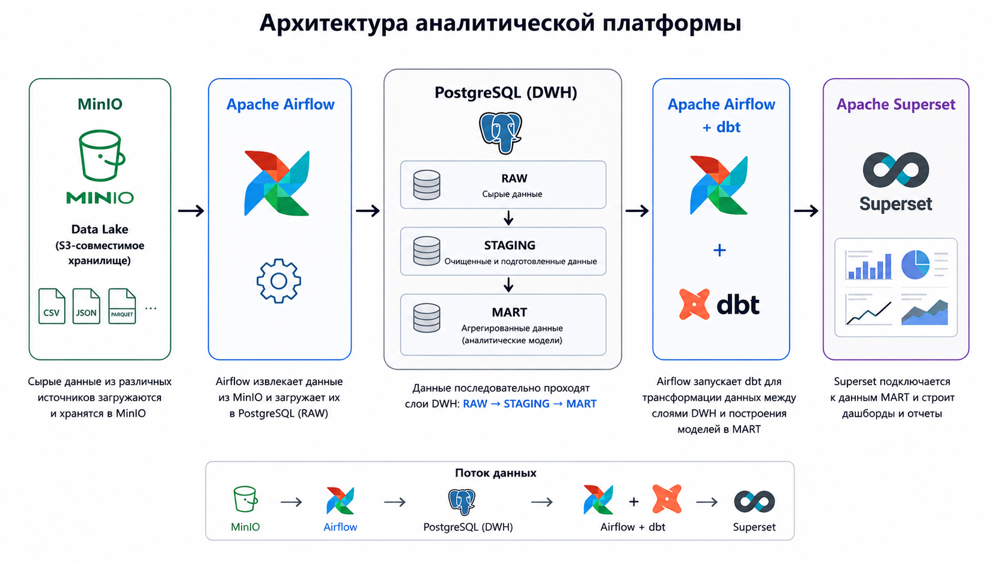

# Data Analytics Platform

Полноценная аналитическая платформа, развернутая на одном сервере с использованием Docker Compose.

Проект демонстрирует построение современного аналитического стека Data Engineer / Analytics Engineer:

* PostgreSQL как DWH
* Apache Airflow для оркестрации пайплайнов
* dbt для трансформации данных
* MinIO как Data Lake (S3-compatible storage)
* Apache Superset для визуализации и BI

---

## Архитектура

```text
                    +----------------+
                    |  Source Data   |
                    | CSV / API / ETL|
                    +--------+-------+
                             |
                             v
                    +----------------+
                    |     Airflow    |
                    | Orchestration  |
                    +--------+-------+
                             |
                             v
                    +----------------+
                    |     MinIO      |
                    | Data Lake (S3) |
                    +--------+-------+
                             |
                             v
                    +----------------+
                    | PostgreSQL DWH |
                    |      raw       |
                    +--------+-------+
                             |
                             v
                    +----------------+
                    |      dbt       |
                    |   staging      |
                    +--------+-------+
                             |
                             v
                    +----------------+
                    |      dbt       |
                    |      mart      |
                    +--------+-------+
                             |
                             v
                    +----------------+
                    |   Superset     |
                    | Dashboards BI  |
                    +----------------+
```

---

## Технологический стек

| Компонент          | Назначение               |
| ------------------ | ------------------------ |
| PostgreSQL         | Хранилище данных         |
| Airflow            | Оркестрация ETL/ELT      |
| dbt                | Трансформация данных     |
| MinIO              | Объектное хранилище      |
| Superset           | BI и дашборды            |
| Docker Compose     | Управление сервисами     |

---


## Data Warehouse

Используется классическая трехслойная модель DWH.

### RAW

Сырые данные без изменений.

### STAGING

Очистка и стандартизация данных.

### MART

Готовые аналитические витрины.

---

Добавлено версионирование объектов в Superset, автоматизировано с помощью Airflow. Выгружаются все дашборды и датасеты (yaml), разархируются и складываются в папку ./superset/superset_export

---

Планируемые улучшения:

* Great expectations для проверок и тестов
* CI/CD через GitHub Actions
* Kafka для streaming data
* SCD Type 2 модели в dbt
* Data Lineage
* OpenMetadata
* Apache Spark

---

## Автор

Pet-проект для демонстрации навыков Data Engineer / Analytics Engineer.

Развернут полностью в Docker-контейнерах на одном сервере.
